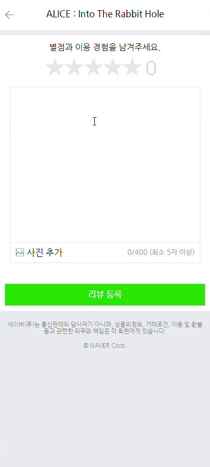
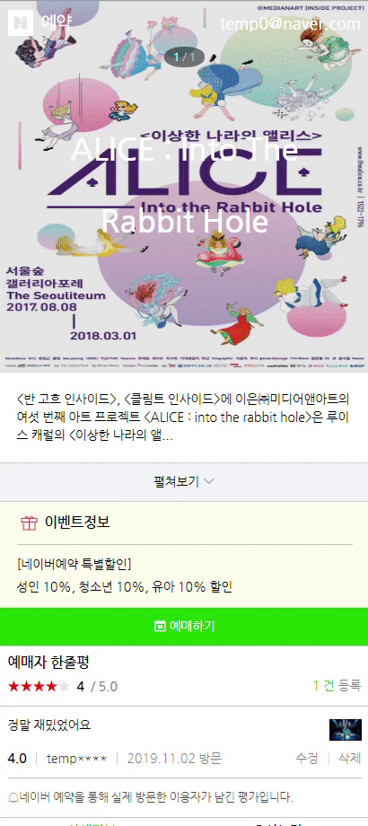

# Naver Booking

Naver Booking Clone Coding conducted by Edwith as a task

## Example

<table align="center" width="100%">
  <tr>
    <td align="center">
    <h3>Main page</h3>
    
     </td>
    <td align="center">
    <h3>Detail page </h3>
    
    </td>
  </tr>
  <tr>
    <td align="center">
    <h3>Reservation Page</h3>
    
     </td>
    <td align="center">
    <h3>Confirm page</h3>
    
    </td>
  </tr>
    <tr>
    <td align="center">
    <h3>Comment page1</h3>
    
     </td>
    <td align="center">
    <h3>Comment page2</h3>
    
    </td>
  </tr>
</table>
